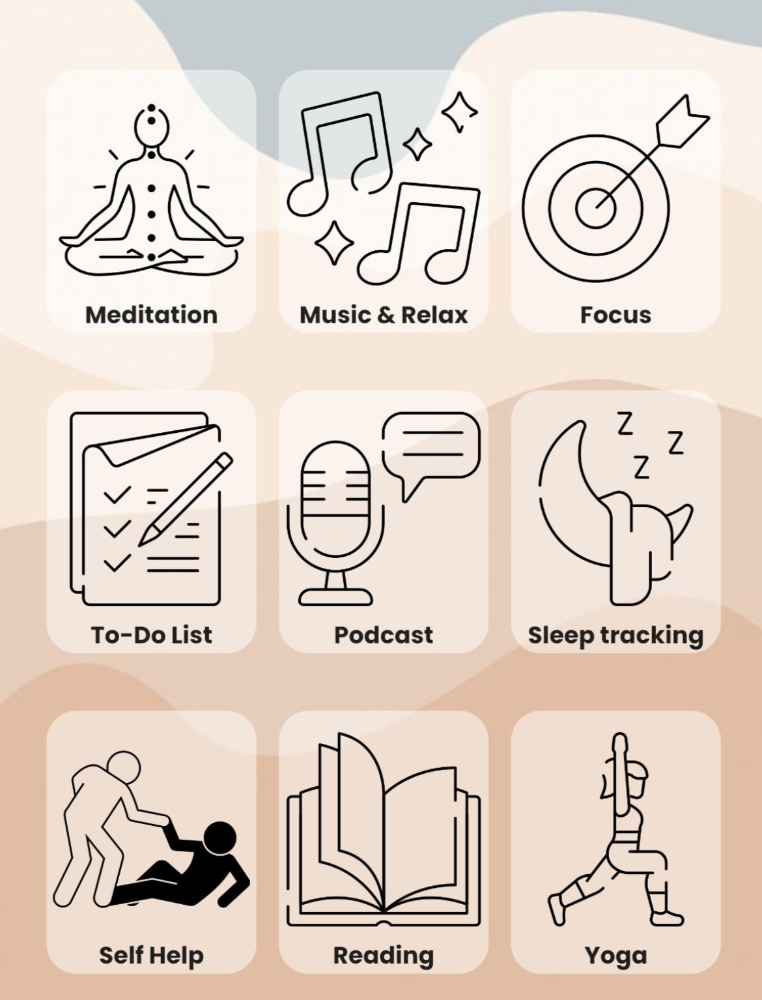

## Activity Button

A customizable widget for creating activity buttons with an image and text.
(Refer to the example image given.)

## Features

- Displays an image and text.
- Supports onTap callback.
- Customizable with width and height ratios.

## Getting started

To use this package, add `activity_button` as a dependency in your `pubspec.yaml` file.
You can then import the package in your Dart code and use the `ActivityButton` widget.

## Usage
[](https://github.com/neminsheth/activity_button)
Here's an example of how to use the `ActivityButton` widget:

```dart
ActivityButton(
  title: 'Sample Activity',
  imagePath: 'assets/images/sample_activity.png',
  onTap: () {
    // Handle button tap event
  },
)
